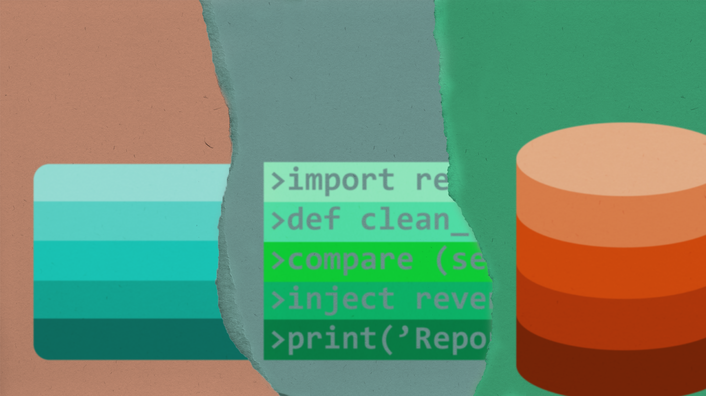

# READ ME
## Revenue Upload Application
### Version 1.0.1

 
### __Created for Dynamic Gaming Solutions__

By: Paul Collins | Data Analyst and Programmer

Thank you for taking time to read on the revenue upload application. The Revenue Upload Application replaced the original revenue upload process. 

1. Original Upload Process
2. Revenue Upload Application
3. Installation
4. Running Revenue Upload Application
5. Security Measures
6. More Info

### 1) Original Upload Process
The original upload process, set up by Burl "Buddy" Harlin, focused on using a native process builder (flow) from Microsoft SQL Server Management Studio (SSMS). The flow from SSMS used a Microsoft Excel Comma Delineated Sheet (CSV) to upload the revenue data into DGS_SLOT.dbo.revenue (revenue table). From the revenue table, the Master Insert Query was used to process the revenue to DGS_SLOT.dbo.Master_Revenue (Master Revenue Table), where data visualizers such as Tableau and Microsoft Excel using a SQL connection can be uses to organize and analyze the data.

Some of the flaws that came from the SSMS flow: 

- The CSV was a strict link. The link was for only one file, meaning the file had to be reset after each use. If the upload file needed to be preserved, the data needed to be save in a separate file before being reset.

- The SSMS flow was machine specific. The flow only existed on the machine it was created on. This can lead to issues should there be a hard drive corruption. In sever corruptions, a data on a hard drive may be irretrievable.

- The upload was separate from the detail sheet. During the revenue checking process, a detail sheet containing to original math and data is created to check if the information from the casino is correct. This is the time to check if machine swaps and conversions have been entered correctly on the casino side. Keeping the detail sheet and the upload sheet can create confusion if any issue is found down the line. 

- The process required knowledge on one specific program. While all versions of SQL databases are relatively interchangeable, specific Integrated Development Environments (IDE) and Server Management Software require pre-existing knowledge on the specific program.

- The flow was format specific. SQL does its best with reading data, but format restrictions can cause issues in the reading process. Incorrect formatting can cause failed uploads or uploads that don't read properly later in the revenue's processing.

### 2) Revenue Upload Application

The Revenue Upload Application achieves the same goal as the original upload process with fewer steps, a user friendly Graphics User Interface (GUI), and a more robust upload process. Since the original upload process was machine specific, and the specific machine was still in use, other methods had to be explored for anyone other than the original user of the machine to upload the revenue.

The first attempt came from another native function in SSMS, where a CSV can be uploaded as a new table. The new table was then inserted into the revenue table, then deleted. While functional, it was as tedious, if not more, than the original upload process.

Looking for solutions, an quicker option of using Python to read the upload sheets and inject them into the revenue table was developed. After getting the upload script functional, the next logical step was to make it easier, should the one to upload the revenue become sick or injured. A browser based flask GUI was applied, and is where it currently sits.

Improvements from tne Revenue Upload Application include:

- Accepts standard Excel as a drag and drop. The upload file is not strict, and only requires the relevant headers. There is a revenue template within the application directory, preset with the headers.

- Uses relative connections, allowing transfer to other machines. This allows a functional backup to exist in a code repository, and adds the option of scalability where multiple people can process revenue without requiring use of the same machine.

- All relevant information can be contained in one file. The details page and the upload page are combined in a single workbook, using the previously mentioned template. This makes comparing and fixing potential issues significantly easier. 

- While general understanding of either an IDE or the command line would be helpful, simple instructions below should be more than sufficient to allow most people to access the application and GUI. Once running, it is simply a matter of dragging the completed revenue sheet to the upload square.

- Python handles formatting for data significantly better than SQL. This makes inserting data easier, and allows for more specific information to be entered.

### 3) Installation

If you don't have Python downloaded on your machine, you are going to need to download the latest version [here](https://www.python.org/downloads/).

1. A copy of the application's directory is located in a private GitHub repository. 

2. Once the directory is downloaded, place the directory into "C:\Program Files"

3. Find the program "command prompt" and run it

4. Open the command prompt and type in (pip install -r "C:\Program Files\Dynamic Analysis\bin\requirements.txt"), without the parenthesis, and hit enter.

45 You're done.

### 4) Running Revenue Upload Application

Since Revenue Upload Application is a flask application, it must run as a self-hosted browser app. There are two ways to activate the application. If the user is familiar with a specific IDE, running the root file "run.py" in a dedicated terminal should work. If not, the first set of instructions are done in the command terminal - 

1. Find the program "command prompt" and run it. 

2. In the command prompt, type in (cd "C:\Program Files"), without the parenthesis, and hit enter.

3. In the command prompt, type in (py "run.py"), without the parenthesis, and hit enter.

After this, both the IDE option and the command prompt option should be in sync.

4. Once the command prompt stops for 3-5 seconds, there should be a local IPV4 address displayed (likely 127.0.0.1:5000). Copy and past the IP address into a browser search window, and hit enter in the browser.

5. The first thing that should pop-up is the login screen. Type in your pre-determined username and password, and click "Login".

6. You'll be met with the upload page. After filling out the revenue template, drag and drop the file into the upload square, and hit the "Upload" button. Hit the "Cancel" button after uploading.

7. Repeat as needed for each revenue upload.

8. Close everything once done.

### 5) Security Measures

The predetermined username and password must be communicated before accessing the application. The credentials are maintained in the SQL server. To maintain security to the SQL server, the SQL credentials are contained in a Keepass password database. The Keepass database is locked behind a key file that is obtained by request, and a seperate file containing a 128 character ASCII password located in the metadata of the following photo.

### 6) More Info

For more information, please contact [Paul Collins](mailto:paulc@dynamicgamingsolutions.com) at paulc@dynamicgamingsolutions.com